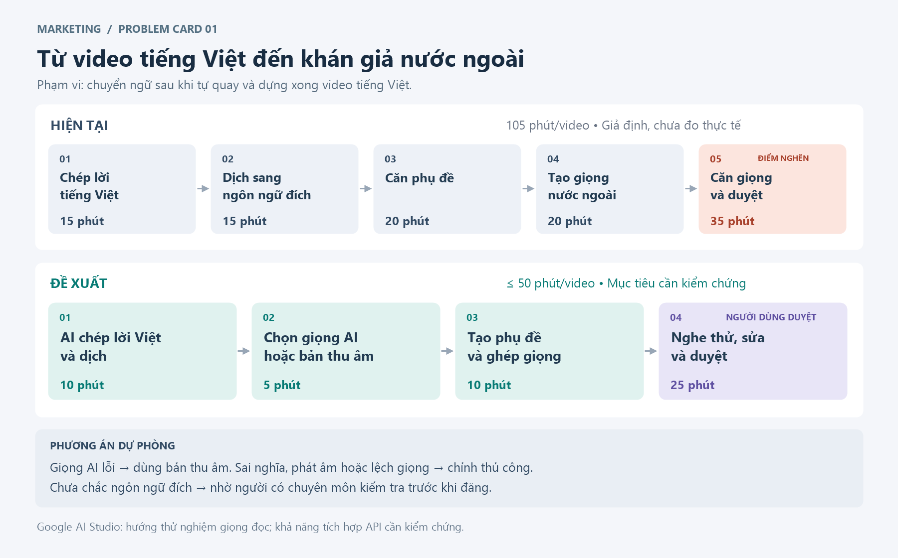

# 01 — Individual Problem Scan

> Điền theo Phase 1 + Phase 2 trong `01-worksheet.md`. Tự scan trước, dùng AI sau để phản biện. Không copy ví dụ Weekly Report.

## Thông tin cá nhân

- Họ và tên: Dương Thị Hồng Viên
- Mã học viên: 2A202602385
- Vai trò / bối cảnh (VD: sinh viên năm X, intern PM, ...): Sinh viên năm cuối làm BA/DA + Marketing
- Công việc hằng tuần (3-5 gạch đầu dòng để soi problem):
  - Tự lên nội dung, quay và dựng video bằng tiếng Việt.
  - Dịch phụ đề, lồng tiếng nước ngoài và kiểm tra video trước khi đăng cho khán giả nước ngoài.
  - Tổng hợp yêu cầu và theo dõi tiến độ nội dung marketing.
  - Thu thập, làm sạch và báo cáo dữ liệu chiến dịch marketing.
  - Đi làm theo hai trường hợp: tự lái ô tô điện Vin và tìm trạm sạc khi cần; hoặc đặt xe qua ứng dụng.

---

## Phase 1 — Scan 5+ problems (tối thiểu 5, khuyến khích 8-10)

**Cách điền:** mỗi dòng = việc gì + ai chịu + đo bằng gì. Cột `Dấu hiệu thật` bắt buộc có số: mất bao lâu (bấm giờ mấy lần), mấy lần/tuần, bao nhiêu người gặp, log/ticket/quote nào.

| # | Lăng kính (Lặp lại / Tốn thời gian / AI có thể tốt hơn / Pain từ người khác) | Problem quan sát được | Ai chịu ảnh hưởng? | Dấu hiệu thật (số + bằng chứng) |
|---|---|---|---|---|
| 1 | Lặp lại | Nghe lại video tự quay bằng tiếng Việt để chép lời, dịch và căn phụ đề tiếng nước ngoài. | Marketing | Chưa có số đo; bấm giờ 3 video, lưu file phụ đề để đối chiếu. |
| 2 | Tốn thời gian | Sửa và tạo lại lời lồng tiếng nước ngoài vì không khớp thời lượng cảnh đã quay. | Marketing và người duyệt | Chưa có số đo; ghi phút xử lý và lượt sửa giọng của 3 video. |
| 3 | Lặp lại | Sửa tên cột và định dạng khác nhau trước khi ghép dữ liệu chiến dịch. | DA | Chưa có số đo; ghi thời gian chuẩn hóa và số lỗi của 2 báo cáo. |
| 4 | Pain từ người khác | Hỏi lại yêu cầu cuối vì các thay đổi nằm rải rác trong tin nhắn. | BA và người duyệt | Chưa có số đo; đếm lượt hỏi lại trong 1 tuần, đối chiếu nhóm chat. |
| 5 | Lặp lại | Khi đặt xe đi làm, phải kiểm tra lại giá và thời gian chờ trước khi chọn chuyến. | Bản thân khi đặt xe | Chưa có số đo; bấm giờ 5 lần đặt xe, lưu thời điểm xác nhận. |
| 6 | Tốn thời gian | Khi tự lái ô tô điện Vin đi làm, phải so sánh trạm sạc phù hợp tuyến đường và lịch làm việc. | Bản thân khi tự lái xe | Chưa có số đo; ghi thời gian tìm và số trạm kiểm tra trong 3 lần sạc. |
| 7 | AI có thể tốt hơn | Dịch sát lời Việt khiến câu quảng cáo thiếu tự nhiên với khán giả nước ngoài; phải sửa theo ngữ cảnh thị trường. | Marketing | Gợi ý cần tự xác nhận; kiểm tra 3 video, ghi số câu sửa nghĩa và phút tra cứu. |
| 8 | Tốn thời gian | Tìm lại video, phụ đề và bản thu tương ứng vì nhiều phiên bản có tên gần giống nhau. | Marketing | Gợi ý cần tự xác nhận; bấm giờ 5 lần tìm file, ghi số lần mở nhầm bản. |
| 9 | AI có thể tốt hơn | Đọc phản hồi từ nhiều kênh để nhóm ý kiến khách hàng theo chủ đề và ngữ cảnh. | BA/DA + Marketing | Gợi ý cần tự xác nhận; thử 30 phản hồi, ghi thời gian phân nhóm và số ý cần hỏi lại. |
| 10 | Pain từ người khác | Người dựng video phải hỏi lại đoạn cần sửa vì phản hồi duyệt thiếu mốc thời gian cụ thể. | Người dựng và người duyệt video | Gợi ý cần tự xác nhận; xem 3 lượt duyệt, đếm câu hỏi làm rõ và ghi thời gian chờ. |

> Gợi ý tự soi: tuần trước mất nhiều thời gian nhất vào việc gì? Việc gì hay trì hoãn? Người khác hay hỏi lại câu gì? Workflow nào ai cũng biết là chậm?

**AI đã dùng ở Phase 1 (nếu có):**
- Prompt đã hỏi: Điền theo form cho sinh viên năm cuối làm BA/DA + Marketing; tự quay video tiếng Việt, dịch/lồng tiếng nước ngoài để đăng ở nước ngoài; thêm đặt xe và sạc ô tô điện Vin.
- Ý dùng được: Dùng bối cảnh phụ đề, lồng tiếng, dữ liệu, đặt xe và sạc xe để viết rõ vấn đề; dòng 7–10 là gợi ý bổ sung cần tự xác nhận.
- Ý bỏ vì không phải pain thật: Chưa chốt; bỏ các gợi ý không khớp trải nghiệm sau khi xem lại file, tin nhắn và nhật ký cá nhân.

**Self-check Phase 1:**
- [ ] Đủ 5+ dòng, mỗi dòng có actor + số đo cụ thể
- [x] Dùng ít nhất 3/4 lăng kính
- [x] Không có dòng chung chung kiểu "mất nhiều thời gian"

---

## Phase 2 — Top 3 Problem Cards

### 2.1. Chọn top 3

Giữ bài nào: actor cụ thể, workflow vẽ được 3-7 bước, bottleneck ở 1 bước, impact đo được. Loại bài quá rộng.

| Rank | Problem (copy từ bảng scan) | Vì sao chọn (2-3 ý) | Điều còn chưa chắc |
|---|---|---|---|
| 1 | Dịch phụ đề và lồng tiếng nước ngoài cho video tự quay (#1–2) | Sát công việc; đo được thời gian và số lượt sửa. | Chất lượng bản dịch, giọng đọc và khả năng tích hợp dịch vụ giọng nói thử qua Google AI Studio. |
| 2 | Chuẩn hóa dữ liệu chiến dịch (#3) | Lặp lại theo báo cáo; dễ đối chiếu kết quả. | Mức khác biệt giữa các file đầu vào. |
| 3 | Tìm trạm sạc ô tô điện Vin (#6) | Tiêu chí rõ; ảnh hưởng lịch đi làm. | Độ mới của dữ liệu trạm và thời gian chờ. |

### 2.2. Problem Cards chi tiết (lặp lại cho cả 3 cards)

---

#### Problem Card #1 — Dịch phụ đề và lồng tiếng nước ngoài cho video tự quay

```text
Problem 1 câu: Người làm Marketing mất thời gian chuyển video tự quay bằng tiếng Việt thành bản phụ đề và lồng tiếng nước ngoài để đăng cho thị trường mục tiêu.

Actor: Sinh viên năm cuối làm Marketing.

Thời điểm / bối cảnh: Sau khi tự quay và dựng xong video tiếng Việt, cần làm bản tiếng nước ngoài trước khi đăng.

Current workflow 3-7 bước:
1. Chép lời từ bản dựng video tiếng Việt đã tự quay.
2. Dịch lời thoại sang ngôn ngữ của thị trường mục tiêu.
3. Chia câu và căn phụ đề tiếng nước ngoài.
4. Thu hoặc tạo giọng đọc tiếng nước ngoài.
5. Căn giọng theo cảnh, kiểm tra nghĩa và duyệt bản sẵn sàng đăng.

Bottleneck: Bước 5, căn lời dịch vừa thời lượng từng cảnh.

Impact: Chậm có bản đăng ở nước ngoài; giả định 105 phút/video, chưa đo; chỉ tính khâu chuyển ngữ sau quay/dựng.

Success metric: Thử 3 video cùng độ dài, cùng ngôn ngữ đích; đo từ lúc nhận bản dựng Việt đến bản chuyển ngữ đã duyệt. Mục tiêu trung bình ≤ 50 phút/video, gồm chờ AI và sửa; người biết ngôn ngữ đích xác nhận đúng ý, phát âm rõ, phụ đề lệch ≤ 1 giây.

Non-AI alternative: Nhờ người biết ngôn ngữ đích dịch và thu âm; dùng mẫu phụ đề, bảng thuật ngữ và giới hạn thời lượng từng câu.

AI hypothesis: AI chép lời Việt, dịch và tạo phụ đề. Dự kiến thử giọng đọc qua Google AI Studio, sau đó kiểm chứng khả năng tích hợp API. Người dùng chọn ngôn ngữ, giọng đọc AI hoặc tải bản thu âm ngôn ngữ đích; nghe thử, căn giọng và duyệt trước khi đăng.

Quick gut:
[ ] No AI / process fix
[ ] Rule
[x] Workflow
[ ] Agent
[ ] Chưa biết
```

**Draft workflow Card #1** (ASCII / Mermaid / ảnh đính kèm):

```text
CURRENT STATE — 105 phút/video (giả định, sau khi quay/dựng tiếng Việt)

[1 Chép lời Việt: 15'] → [2 Dịch sang ngôn ngữ đích: 15'] → [3 Căn phụ đề: 20'] → [4 Tạo giọng nước ngoài: 20'] → [5 Căn giọng và duyệt: 35', bottleneck]

FUTURE STATE — ≤ 50 phút/video (mục tiêu)

[1 AI chép lời Việt và dịch: 10'] → [2 Chọn giọng AI hoặc bản thu âm: 5'] → [3 Tạo phụ đề, ghép giọng: 10'] → [4 Người dùng nghe thử, sửa và duyệt: 25']  <-- human boundary

Fallback: nếu dịch vụ giọng AI lỗi thì dùng bản thu âm; sai nghĩa, phát âm hoặc lệch giọng thì sửa thủ công. Chưa chắc ngôn ngữ đích thì nhờ người có chuyên môn kiểm tra trước khi đăng.
```

File đính kèm (nếu vẽ riêng): `01-individual-problem-scan-workflow-card-1.png`



---

#### Problem Card #2 — Làm sạch và tổng hợp dữ liệu chiến dịch Marketing

```text
Problem 1 câu: DA mất thời gian làm sạch và ghép dữ liệu từ nhiều file trước khi lập báo cáo Marketing.

Actor: Sinh viên năm cuối làm DA.

Thời điểm / bối cảnh: Khi lập báo cáo hiệu quả chiến dịch hằng tuần.

Current workflow 3-7 bước:
1. Nhận các file dữ liệu từ nhiều nguồn.
2. Chuẩn hóa tên cột và định dạng dữ liệu.
3. Kiểm tra dòng trùng; đánh dấu dữ liệu thiếu hoặc sai để xác nhận.
4. Ghép dữ liệu và tính các chỉ số.
5. Tạo bảng tổng hợp để quản lý kiểm tra.

Bottleneck: Bước 2, chuẩn hóa dữ liệu, vì mỗi file có tên cột và định dạng khác nhau.

Impact: Chậm báo cáo, dễ sai chỉ số; giả định minh họa 90 phút/báo cáo, chưa đo.

Success metric: Thử 2 bộ dữ liệu tương đương, đo từ nhận file đến báo cáo đã kiểm tra. Mục tiêu trung bình ≤ 35 phút/báo cáo; chỉ số khớp đáp án, phát hiện ≥ 95% lỗi đã gán nhãn.

Non-AI alternative: Dùng Excel Power Query và mẫu cột thống nhất cho tất cả file.

AI hypothesis: Ưu tiên Rule/Power Query vì chuẩn hóa và tính chỉ số có quy tắc rõ. Chỉ thử AI giải thích lỗi nếu còn tốn thời gian; chưa cần Agent.

Quick gut:
[ ] No AI / process fix
[x] Rule
[ ] Workflow
[ ] Agent
[ ] Chưa biết
```

**Draft workflow Card #2:**

```text
CURRENT STATE — 90 phút/báo cáo (giả định)

[1 Nhận file: 10'] → [2 Chuẩn hóa: 35', bottleneck] → [3 Làm sạch: 15'] → [4 Tính chỉ số: 20'] → [5 Tổng hợp: 10']

FUTURE STATE — ≤ 35 phút/báo cáo (mục tiêu)

[1 Nạp file: 5'] → [2 Power Query chuẩn hóa, đánh dấu lỗi: 15'] → [3 Tính chỉ số và xuất bảng: 5'] → [4 Người phụ trách kiểm tra: 10']  <-- human boundary

Fallback: nếu thiếu cột, sai định dạng hoặc tổng số không khớp thì dừng, hỏi người cung cấp và kiểm tra thủ công; giữ nguyên file gốc.
```

File đính kèm: Không vẽ riêng; dùng sơ đồ ASCII ở trên.

---

#### Problem Card #3 — Tìm trạm sạc ô tô điện Vin để đi làm

```text
Problem 1 câu: Khi tự lái ô tô điện Vin đi làm, sinh viên mất thời gian chọn trạm sạc phù hợp tuyến đường và lịch làm việc.

Actor: Sinh viên năm cuối tự lái ô tô điện Vin đi làm.

Thời điểm / bối cảnh: Những ngày tự lái xe, cần chọn nơi sạc trước hoặc sau giờ làm khi pin thấp.

Current workflow 3-7 bước:
1. Kiểm tra mức pin và thời gian cần sử dụng xe.
2. Mở ứng dụng hoặc bản đồ tìm trạm.
3. Kiểm tra khoảng cách, loại cổng và giờ hoạt động.
4. So sánh các trạm phù hợp.
5. Xác nhận trạm đã chọn; kết thúc đo trước khi di chuyển.

Bottleneck: Bước 3 vì thông tin cần kiểm tra nằm ở nhiều nơi và chưa chắc phản ánh đúng khả năng phục vụ hiện tại.

Impact: Có thể chậm giờ làm; giả định minh họa 15 phút/lần chọn trạm, chưa đo.

Success metric: Thử 10 tình huống có dữ liệu trạm xác định trước; trung bình ≤ 5 phút từ nhập nhu cầu đến xác nhận. Đề xuất đúng điều kiện hoặc yêu cầu kiểm tra thủ công trong 10/10 tình huống; không tính di chuyển và sạc.

Non-AI alternative: Lưu danh sách trạm quen thuộc và dùng bộ lọc theo khoảng cách, loại cổng.

AI hypothesis: Rule lọc danh sách trạm được cung cấp theo loại xe/cổng, vị trí và giờ hoạt động; AI giải thích lựa chọn. Người dùng xác nhận; hệ thống không tự suy quãng đường còn lại từ phần trăm pin hay tự đặt chỗ sạc.

Quick gut:
[ ] No AI / process fix
[ ] Rule
[x] Workflow
[ ] Agent
[ ] Chưa biết
```

**Draft workflow Card #3:**

```text
CURRENT STATE — 15 phút/lần (giả định)

[1 Kiểm tra pin: 1'] → [2 Tìm trạm: 3'] → [3 Kiểm tra điều kiện: 7', bottleneck] → [4 So sánh: 3'] → [5 Xác nhận: 1']

FUTURE STATE — ≤ 5 phút/lần (mục tiêu)

[1 Nhập vị trí, xe/cổng và giờ sạc: 1'] → [2 Rule lọc + AI giải thích: 2'] → [3 Người dùng kiểm tra và chọn: 2']  <-- human boundary

Fallback: nếu dữ liệu thiếu hoặc quá cũ thì hiển thị danh sách trạm để người dùng kiểm tra thủ công; không tự khẳng định trạm còn chỗ.
```

File đính kèm: Không vẽ riêng; dùng sơ đồ ASCII ở trên.

---

### 2.3. Card muốn pitch nhất (chuẩn bị 2 phút)

**Card tôi muốn pitch nhất:**

```text
Problem Card #1 — Dịch phụ đề và lồng tiếng nước ngoài cho video tự quay.
```

**Vì sao (2-3 câu: workflow gì, số đo gì, impact gì):**

```text
Công việc này sát công việc Marketing, điểm nghẽn là căn lời thoại theo cảnh. Mục tiêu thử nghiệm là ≤ 50 phút/video, tính cả sửa và duyệt; cần đo hiện trạng trước khi so sánh.
```

**Câu hỏi tôi muốn nhóm challenge (1-2 câu hỏi đúng chỗ yếu):**

```text
Ai đánh giá bản dịch và giọng đọc? Tính cả sửa và duyệt, AI còn tiết kiệm thời gian không?
```

**AI phản biện Card (nếu có):**
- Điểm yếu AI chỉ ra: Bản dịch có thể sai ngữ cảnh, giọng đọc thiếu tự nhiên và metric “đúng ý” còn khó đo.
- Tôi sửa gì: Chỉ dùng AI tạo bản nháp; người làm Marketing đối chiếu video gốc, sửa thuật ngữ và duyệt trước khi xuất bản.

### Self-check nộp phần 01
- [x] Có 5+ problems + top 3 Cards đủ field
- [x] Mỗi Card có workflow trước/sau + bottleneck + metric + fallback
- [x] Đã chọn 1 card pitch + câu hỏi challenge
